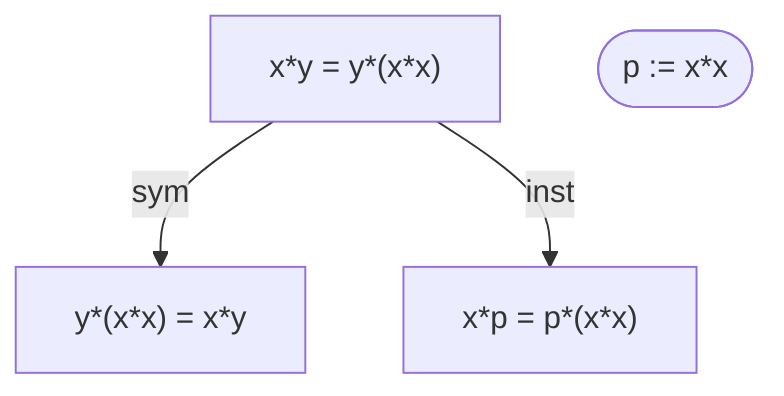

# magmaexplorer

Magmaexplorer is an interactive Python REPL for exploring [equational theories](https://teorth.github.io/equational_theories/) of magmas — algebraic structures with a single binary operator `*` and no built-in laws. You seed a session with one or more equations or definitions over single-letter variables, then grow the list in three ways: typing additional equations or definitions directly, invoking mechanically-verified derivation primitives (a small six-primitive DSL), or prompting an LLM to derive new equations expressed as DSL steps that the tool re-executes and verifies. Completed derivation trees can be exported to structured YAML files suitable for downstream tooling or archiving.


## Installation

```bash
python -m venv .venv
.venv/bin/pip install -e '.[dev]'
```

LLM features (everything involving the Anthropic API) require:

```bash
export ANTHROPIC_API_KEY=sk-ant-...
```

All other features — direct input, DSL derivation primitives, save/load, `/list`, `/deduction`, `/report`, `/lean`, `/lean-implication` — work without the key.


## Quickstart

```text
$ .venv/bin/python -m magmaexplorer
magma> x*y=y*(x*x)
[0] x*y = y*(x*x)
magma> p := x*x
[1] p := x*x   [definition]
magma> /sym 0
[2] y*(x*x) = x*y   from [0]
magma> derive x*y = y*p from entries 0 and 1
[3] x*y = y*p   from [0, 1]
    1. ✓ inst [0] y:=p
    [verified]
magma> /list
 #     kind        statement             sources   steps
 [0]   equation    x*y = y*(x*x)        -         -
 [1]   definition  p := x*x             -         -
 [2]   equation    y*(x*x) = x*y        0         1. sym [0]
 [3]   equation    x*y = y*p            0, 1      1. ✓ inst [0] y:=p
magma> /quit
bye.
```


## Term Grammar

```
entry      := equation | definition
equation   := term '=' term
definition := variable ':=' term          # syntactic abbreviation, NOT an equation
term       := primary ('*' primary)*      # left-associative
primary    := variable | '(' term ')'
variable   := [a-z]
```

`*` is left-associative: `x*y*z` parses as `(x*y)*z`. The pretty-printer emits parentheses around any right-child that is itself a product, so the round-trip is lossless. Use explicit parentheses to express right-associative groupings: `x*(y*z)`.

All whitespace is stripped before parsing, so `x * y = y * (x * x)` and `x*y=y*(x*x)` are identical.


## Item Kinds

### Equations

An equation `lhs = rhs` is a magma identity. Both sides are parsed as terms and stored. Equations can be used as:
- rewrite rules (left-to-right or backwards)
- sources for transitivity chains
- targets for instantiation (variable substitution)

### Definitions

A definition `name := body` is a **syntactic abbreviation** — it says that the single-letter variable `name` stands for `body`. Definitions are **not** magma equations; the LLM is explicitly told not to treat them as one. Definitions are used by the `expand` and `fold` primitives, which substitute in either direction.


## Commands Reference

### Direct Input

```text
<term>=<term>
```
Parse and append a new equation. Example: `x*y=y*(x*x)`.

```text
<var>:=<term>
```
Parse and append a new definition. Example: `p := x*x`.

### Inspection

```text
/list
```
Display the full numbered list as a table (columns: index, kind, statement, sources, steps).

```text
/help
```
Print a condensed command reference.

```text
/quit
/exit
```
Exit the REPL. `Ctrl-D` also works.

### State Management

```text
/clear
```
Empty the entire list. Prompts for confirmation (`y/N`).

```text
/clear <i>
```
Delete entry `[i]` and every entry transitively derived from it (cascading delete). The implementation walks the `sources` graph: any entry `j` whose `sources` list contains a doomed index is also doomed, and this repeats until no new entries are added. After deletion all remaining entries are renumbered sequentially from 0 and their `sources` lists are rewritten to match. Prompts `delete [i] and N dependent entries? [y/N]`.

```text
/save <path>
```
Write the current list to a JSON file at `<path>`. See [JSON Save Format](#json-save-format) for the schema.

```text
/load <path>
```
Replace the current list from a JSON file. The file must match the save schema (back-compat: files with `justification` instead of `steps` are also accepted).

```text
/debug
```
Toggle debug mode. When on, the exact user-message payload sent to the LLM is printed before every LLM call.

### Derivation Primitives (DSL)

Each slash-command below runs a single DSL primitive, appends the resulting equation, and prints it immediately. The entry's `sources` and `steps` are set automatically.

```text
/sym <i>
```
Swap the sides of equation `[i]`. Produces `rhs = lhs`. Errors if `[i]` is a definition.

Example:
```text
magma> x*y=y*(x*x)
[0] x*y = y*(x*x)
magma> /sym 0
[1] y*(x*x) = x*y   from [0]
```

---

```text
/inst <i> x:=t [, y:=u ...]
```
Simultaneous variable substitution in equation `[i]`. All listed variables are replaced atomically (so swapping `x` and `y` works correctly). Errors if `[i]` is a definition.

Example:
```text
magma> x*y=y*(x*x)
[0] x*y = y*(x*x)
magma> /inst 0 x:=a*b, y:=c
[1] (a*b)*c = c*((a*b)*(a*b))   from [0]
```

---

```text
/trans <i> <j>
```
Transitivity. Both `[i]` and `[j]` must be equations. The primitive auto-detects which side is shared, trying four orientations in order:
1. `i.rhs == j.lhs` → result is `i.lhs = j.rhs`
2. `i.lhs == j.lhs` → result is `i.rhs = j.rhs`
3. `i.rhs == j.rhs` → result is `i.lhs = j.lhs`
4. `i.lhs == j.rhs` → result is `i.rhs = j.lhs`

Errors if no shared side exists.

Example:
```text
magma> a=b
[0] a = b
magma> b=c
[1] b = c
magma> /trans 0 1
[2] a = c   from [0, 1]
```

---

```text
/rewrite <i> using <j> [backwards]
```
Treat equation `[j]` as a rewrite rule and replace one leftmost-outermost occurrence of the pattern inside equation `[i]`. Without `backwards` the rule is applied left-to-right (`j.lhs → j.rhs`). With `backwards` it is right-to-left (`j.rhs → j.lhs`). The LHS of `[i]` is tried before the RHS. Errors if no match is found, or if either ref is a definition.

Example:
```text
magma> x*y=y*(x*x)
[0] x*y = y*(x*x)
magma> /inst 0 x:=y, y:=x
[1] y*x = x*(y*y)   from [0]
magma> /rewrite 1 using 0 backwards
[2] y*x = x*(y*y)  ...
```

---

```text
/expand <i> <d>
```
Replace one leftmost-outermost occurrence of the variable `d.name` in equation `[i]` by `d.body`. `[d]` must be a definition. Errors if `d.name` does not appear in `[i]`.

Example:
```text
magma> x*y=y*(x*x)
[0] x*y = y*(x*x)
magma> p := x*x
[1] p := x*x   [definition]
magma> /inst 0 y:=p
[2] x*p = p*(x*x)   from [0]
magma> /expand 2 1
[3] x*(x*x) = (x*x)*(x*x)   from [2, 1]
```

---

```text
/fold <i> <d>
```
The reverse of `expand`: replace one leftmost-outermost occurrence of `d.body` in equation `[i]` by the variable `d.name`. Errors if `d.body` does not appear in `[i]`.

Example:
```text
magma> x*y=y*(x*x)
[0] x*y = y*(x*x)
magma> p := x*x
[1] p := x*x   [definition]
magma> /fold 0 1
[2] x*y = y*p   from [0, 1]
```

### Verification and LLM Commands

```text
<anything not matched above>
```
Any input that does not parse as an equation or definition and does not start with `/` is forwarded to the LLM as a free-text derivation command (see [LLM-Emitted DSL and Verification](#llm-emitted-dsl-and-verification)).

```text
/verify <i>
```
Ask a second, stateless LLM call (the "critic") to review entry `[i]`'s derivation. See [/verify Command](#verify-command). Skips and reports if `[i]` is a definition or an axiom (no sources).

```text
/deduction <from> <to> <name>
```
Export the proof subtree anchored at `[to]` (with `[from]` as a required ancestor) to `<name>.deduction`. See [/deduction Export](#deduction-export).

```text
/report <name>
```
Export the **entire current list** as a markdown file `<name>.md` containing a per-entry table and a mermaid diagram of the deduction DAG. See [/report Export](#report-export).

```text
/lean <name>
```

Export the entire current list as a Lean 4 script `<name>.lean` (or `<name>` if it already ends in `.lean`). Axiom entries become `axiom` declarations, derived entries become `theorem … := by sorry`, and the DSL steps used to derive each one are recorded in the comment above. See [/lean Export](#lean-export).

```text
/lean-implication <from> <to> <name>
```

Export a **single competition-shaped Lean 4 theorem** proving entry `[to]` from entry `[from]`. The hypothesis appears as the proof parameter `h` (no `axiom` declarations — the equational-theories Stage 2 judge rejects those as `incomplete_proof`), intermediate entries are inlined as universally-quantified `have` blocks, and the final tactic block discharges the goal. See [/lean-implication Export](#lean-implication-export).


## Derivation DSL Spec

The DSL grammar (as understood by `parse_step`):

```
step       := primitive args
primitive  := "sym" | "inst" | "trans" | "rewrite" | "expand" | "fold"
ref        := "[" INTEGER "]"  |  "s" INTEGER

sym     <ref>
inst    <ref> <subst-list>
trans   <ref> <ref>
rewrite <ref> "using" <ref> ["backwards"]
expand  <ref> <ref>
fold    <ref> <ref>

subst-list := subst ("," subst)*
subst      := variable ":=" term
```

References come in two forms:
- `[N]` — an entry in the numbered list (0-based `EntryRef`).
- `sN` — the intermediate result of the N-th step within the current derivation (1-based `StepRef`; `s1` is the result of the first step, `s2` the second, etc.).

When you type `/sym 0`, `/inst 0 x:=y`, etc., the REPL automatically wraps bare integers in `[...]` before handing the string to `parse_step`.

### One Worked Example per Primitive

**sym** — swap sides of `[0]`:
```text
sym [0]
```
Input `a = b`, output `b = a`.

**inst** — substitute `x := a*b` and `y := c` simultaneously in `[0]`:
```text
inst [0] x:=a*b, y:=c
```

**trans** — chain `[0]: a=b` with `[1]: b=c` to get `a=c`:
```text
trans [0] [1]
```

**rewrite** — apply rule `[1]` backwards to equation `[0]`:
```text
rewrite [0] using [1] backwards
```

**expand** — unfold definition `[1]` at first occurrence of its name in `[0]`:
```text
expand [0] [1]
```

**fold** — fold definition `[1]` at first occurrence of its body in step result `s2`:
```text
fold s2 [1]
```


## LLM-Emitted DSL and Verification

When a free-text command is routed to the LLM the model is asked (via `SYSTEM_PROMPT`) to respond with exactly one JSON object:

```json
{
  "equation": "lhs = rhs",
  "steps":    ["sym [0]", "inst s1 x:=y", "..."],
  "sources":  [0, 1]
}
```

- `equation` — the claimed new equation (must be parseable).
- `steps` — an ordered array of DSL primitive strings; the final step's result must equal `equation`.
- `sources` — list of entry indices the derivation cites.

After receiving this response the REPL re-executes each step in order:

- `✓ <step>` — step parsed and executed successfully; its result is added to `prior_results` as `s<k>`.
- `✗ <step>   [reason]` — step parsed but execution failed (or the final result does not equal `equation`).
- `? <step>` — step could not be parsed as a DSL primitive (treated as an English fallback).

The entry is appended to the list regardless. If **every** step is `✓` and the final `prior_results[-1]` equals the claimed equation, the entry is marked `[verified]`; otherwise `[unverified]`.

Steps that fail (✗ or ?) introduce a "gap": subsequent steps are still attempted (using whatever prior results exist), but `fully_verified` is forced to `False`.

The LLM is told explicitly:
- There are NO algebraic laws beyond the equations in the list (no associativity, commutativity, cancellation, etc.).
- Definitions are syntactic abbreviations, **not** magma equations.
- Plain-English fallback lines are acceptable but will be marked unverifiable.


## /verify Command

`/verify <i>` makes a **separate, stateless** LLM call using `CRITIC_SYSTEM_PROMPT`. The critic sees only the source items cited by entry `[i]` (not the full list, not the derivation steps) and the claimed equation. It is asked to decide, in plain text, whether the claim follows from those sources in a free magma.

Because this is a second independent call with no shared context from the original producer, it provides an adversarial check. The verdict is printed but does not modify the list.

`/verify` reports "nothing to verify" for:
- Definitions (no mathematical content to check).
- Axioms (entries with no sources — they are assumed rather than derived).


## /deduction Export

```text
/deduction <from> <to> <name>
```

Computes the transitive ancestor set of entry `[to]` (walking `sources` links recursively, including `[to]` itself) and verifies that `[from]` is in that set. If so, writes `<name>.deduction` as a YAML file.

### YAML Structure

```yaml
from: 0
to: 5
entries:
  - index: 0
    kind: equation
    statement: "x*y = y*(x*x)"
    sources: []
    steps: []
  - index: 1
    kind: definition
    name: p
    body: "x*x"
    sources: []
    steps: []
  - index: 5
    kind: equation
    statement: "x*y = y*p"
    sources: [0, 1]
    steps:
      - "✓ fold [0] [1]"
```

Notes:
- `entries` is sorted by index and contains only the ancestors of `[to]` (the minimal proof subtree).
- For equations: the row has `statement` (pretty-printed).
- For definitions: the row has `name` and `body` (pretty-printed).
- `sources` and `steps` are always present (may be empty lists).


## /report Export

```text
/report <name>
```

Writes `<name>.md`, a self-contained markdown file with **two parts**:

1. A markdown **table** listing every entry — `#`, `Kind`, `Statement`, `Sources`, `Steps` (multi-line cells use `<br>`).
2. A **mermaid `graph TD` block** drawing the deduction DAG. Each entry is a node whose label is the magma equation (or definition) itself, wrapped in mermaid's quoted-string label syntax (`n0["x*y = y*(x*x)"]`). An arrow `na -->|rule| nb` means entry `b` cites entry `a` as a source; the edge label is the DSL primitive (`sym`, `inst`, `trans`, `rewrite`, `expand`, `fold`) that consumed the source while deriving the target. When multiple primitives in the same derivation reference the same source, the names are comma-separated (`n0 -->|sym, inst| n2`). Edges from LLM-produced steps that don't parse as DSL appear unlabeled. Equations are rectangles; definitions are stadiums (`n1(["p := x*x"])`). Standalone axioms appear as isolated nodes with no incoming edges.

Open the resulting `.md` in any mermaid-aware viewer: GitHub or GitLab (renders inline), VS Code with the *Markdown Preview Mermaid Support* extension, Obsidian, or `mmdc` / `mermaid-cli` to render to SVG/PNG.

Example output (abridged) after building `[0]` axiom, `[1]` definition, `[2]` from `/sym 0`, `[3]` from `/inst 0`:

````markdown
# magmaexplorer report: myproof

_4 entries_

## Entries

| # | Kind | Statement | Sources | Steps |
|---|------|-----------|---------|-------|
| [0] | equation | `x*y = y*(x*x)` | - | - |
| [1] | definition | `p := x*x` | - | - |
| [2] | equation | `y*(x*x) = x*y` | 0 | 1. sym [0] |
| [3] | equation | `x*p = p*(x*x)` | 0 | 1. inst [0] y:=p |

## Deduction graph


````

`/report` is read-only: it does not mutate the list.


## /lean Export

```text
/lean <name>
```

Writes `<name>.lean` (the `.lean` extension is added automatically if absent). The script is a self-contained Lean 4 file you can extend into a formal proof of the derivation chain — for example to submit to the [equational-theories distillation challenge](https://competition.sair.foundation/competitions/mathematics-distillation-challenge-equational-theories-stage2/overview).

The structure of the file:

1. **Preamble** — a header comment explaining the file. There is **no `variable {G ...}` declaration**: `axiom` in Lean 4 does not pick up `variable` and `Type*` is a Mathlib-only shorthand, so every axiom and theorem carries its own explicit `{G : Type _} [Mul G]` binders. The file therefore compiles in both vanilla Lean 4 and Mathlib environments without needing any imports.
2. **One block per entry**, in order:
   - **Axiom entries** (no sources, no steps) become `axiom eq_<i> : ∀ <vars> : G, <lhs> = <rhs>` — the equation is asserted as a hypothesis you reason from.
   - **Derived entries** become `theorem eq_<i> : ∀ <vars> : G, <lhs> = <rhs> := by …`, with a comment block above that names the cited sources and lists the DSL steps the REPL used to derive them. For single-step entries whose primitive is `sym`, `inst`, `trans`, or `rewrite` (with `[i]`-style entry references), `/lean` writes a **real proof body** instead of `sorry`:
     - `sym [i]` → `intro <vars>; exact (eq_<i> <vars>).symm`
     - `inst [i] x:=t1, y:=t2` → `intro <vars>; exact eq_<i> <args>` (args follow `[i]`'s alpha-sorted ∀-order; compound terms get parenthesised)
     - `trans [a] [b]` → `intro <vars>; exact (eq_<a> …).trans (eq_<b> …)` with `.symm` insertions for the orientation `dsl.execute_step` actually matched. Any "orphan" variable (bound in `[a]` or `[b]` but not in the result) is filled with the first goal variable — both sides use the same witness so the chain type-checks.
     - `rewrite [i] using [j]` → `intro <vars>; have h := eq_<i> <args>; rw [eq_<j>] at h; exact h` — and `rewrite [i] using [j] backwards` uses `rw [← eq_<j>] at h`. A `-- NOTE` comment warns that Lean's `rw` rewrites **all** occurrences while the DSL only rewrites the leftmost-outermost one; for multi-occurrence cases swap `rw` for `nth_rewrite 1` (from Mathlib).
   - For everything else — multi-step entries, steps using `s<k>` step references, and the `expand`/`fold` primitives — the body still falls back to `sorry`, with a one-line hint comment naming what's missing. Multi-step needs intermediate `have`s that don't preserve universal quantification cleanly; `expand`/`fold` rely on syntactic definitions that have no direct Lean counterpart, so the user fills them in (typically by inlining the definition body, then applying `rw`).
   - **Definitions** appear only as a comment — they are syntactic abbreviations in magmaexplorer with no direct Lean counterpart, so the comment tells you to inline the body wherever the name appears.

Free variables are collected from each equation and quantified at the top of its theorem signature in alphabetical order, so every entry is self-contained.

Example output after `x*y = y*(x*x)`, `p := x*x`, `/sym 0`, `/inst 0 x:=a, y:=b`:

```lean
-- magmaexplorer export: smoke
-- 4 entries
-- (header comment elided; the real file documents the per-declaration
-- binders convention)

-- [0] axiom: x*y = y*(x*x)
axiom eq_0 {G : Type _} [Mul G] : ∀ x y : G, x * y = y * (x * x)

-- [1] definition: p := x*x
--     (syntactic abbreviation; inline `p` as `x * x` where needed)

-- [2] derived from [0]
--     1. sym [0]
theorem eq_2 {G : Type _} [Mul G] : ∀ x y : G, y * (x * x) = x * y := by
  intro x y
  exact (eq_0 x y).symm

-- [3] derived from [0]
--     1. inst [0] x:=a, y:=b
theorem eq_3 {G : Type _} [Mul G] : ∀ a b : G, a * b = b * (a * a) := by
  intro a b
  exact eq_0 a b
```

`/lean` is read-only: it does not mutate the list.


## /lean-implication Export

```text
/lean-implication <from> <to> <name>
```

Writes `<name>.lean` containing **one** Lean 4 theorem — the competition-shaped output the [equational-theories Stage 2 distillation challenge](https://competition.sair.foundation/competitions/mathematics-distillation-challenge-equational-theories-stage2/overview) expects. Unlike `/lean`, which exports your entire derivation log as separate `axiom`/`theorem` blocks, `/lean-implication` consolidates everything into a single proof:

```lean
theorem implication {G : Type _} [Mul G]
    (h : ∀ <vars> : G, <hypothesis equation>) :
    ∀ <vars> : G, <goal equation> := by
  -- intermediate entries inlined as universally-quantified `have` blocks
  have h_<i> : ∀ <vars> : G, <intermediate eq> := by
    intro <vars>
    <DSL-translated tactics, using `h` and earlier `h_<j>`>
  …
  -- final body discharges the goal
  intro <goal vars>
  <DSL-translated tactics>
```

Key properties — all required by the Stage 2 judge:

- **No `axiom` declarations.** The hypothesis is the explicit proof parameter `h`. The judge rejects any submission that introduces a fresh axiom (only `propext`, `Quot.sound`, `Classical.choice` are allowed).
- **No `sorry`.** If every step on the chain from `[from]` to `[to]` is a single auto-translatable DSL primitive (sym, inst, trans, rewrite), the proof is complete. (Multi-step / expand / fold steps would still leave a `sorry`; in that case the command warns rather than emits an unaccepted certificate.)
- **Universally-quantified intermediates.** Each `have h_<i>` is `∀ … : G, …`, so subsequent steps can apply it via `inst`/`sym`/`trans`/`rewrite` exactly as if it were one of the original entries.
- **Self-contained `{G : Type _} [Mul G]` binders** — no Mathlib imports needed, no `Type*` (Mathlib-only).

**When it refuses** (no file written, error printed):

| Cause | Message |
|---|---|
| `[from]` is not an ancestor of `[to]` | `[from] is not an ancestor of [to]` |
| Some ancestor of `[to]` is an axiom other than `[from]` | `[i] is an axiom but is not the hypothesis [from]; cannot prove the goal from `h` alone` |
| Some ancestor is a `Definition` | `[i] is a definition; expand/fold are not yet auto-translated…` |
| `[from]` or `[to]` is a `Definition` | `[i] is not an equation; cannot use as hypothesis/goal` |

For the **equational-theories Lean project specifically**, swap `[Mul G]` for `[Magma G]` and `*` for the project's `◇` notation as needed — the rest of the proof structure ports verbatim.

Worked example (commutativity composed with renaming):

```text
> x*y = y*x          # [0] — input hypothesis
> /sym 0             # [1] — y*x = x*y, from [0]
> /inst 1 x:=a, y:=b # [2] — b*a = a*b, from [1]
> /lean-implication 0 2 commute_impl
```

produces `commute_impl.lean`:

```lean
theorem implication {G : Type _} [Mul G]
    (h : ∀ x y : G, x * y = y * x) :
    ∀ a b : G, b * a = a * b := by
  have h_1 : ∀ x y : G, y * x = x * y := by
    intro x y
    exact (h x y).symm
  intro a b
  exact h_1 a b
```

Run `lean commute_impl.lean` — exit 0, no output, no `sorry`s. That's a judge-accepted Stage 2 certificate.

`/lean-implication` is read-only: it does not mutate the list.


## JSON Save Format

`/save <path>` writes a JSON array; each element has this shape:

```json
[
  {
    "kind": "equation",
    "lhs": "x*y",
    "rhs": "y*(x*x)",
    "sources": [],
    "steps": []
  },
  {
    "kind": "definition",
    "name": "p",
    "body": "x*x",
    "sources": [],
    "steps": []
  },
  {
    "kind": "equation",
    "lhs": "x*y",
    "rhs": "y*p",
    "sources": [0, 1],
    "steps": ["✓ fold [0] [1]"]
  }
]
```

- `kind` is `"equation"` or `"definition"`.
- Equations have `lhs` and `rhs` (pretty-printed strings).
- Definitions have `name` (single letter) and `body` (pretty-printed string).
- `sources` is a list of integer indices.
- `steps` is a list of annotated step strings.

Back-compat: files written by older versions may have `justification` (a string) instead of `steps`; `/load` accepts both forms.


## Worked End-to-End Example

**Goal:** derive commutativity `y*x = x*y` starting from the axiom `x*y = y*(x*x)`.

```text
magma> x*y=y*(x*x)
[0] x*y = y*(x*x)
```

Step 1 — swap variables `x` and `y` in [0]:
```text
magma> /inst 0 x:=y, y:=x
[1] y*x = x*(y*y)   from [0]
```

Step 2 — from [0], substitute `x := x*y`:
```text
magma> /inst 0 x:=x*y
[2] (x*y)*y = y*((x*y)*(x*y))   from [0]
```

Step 3 — from [0], substitute `y := y*x`:
```text
magma> /inst 0 y:=y*x
[3] x*(y*x) = (y*x)*(x*(y*x))   from [0]
```

Step 4 — ask the LLM to close the gap:
```text
magma> using entries 0 and 1, derive y*x = x*y
[4] y*x = x*y   from [0, 1]
    1. ✓ inst [0] x:=y, y:=x
    2. ✓ rewrite s1 using [0] backwards
    [verified]
```

Final `/list` output (abbreviated):

```text
 #     kind      statement             sources   steps
 [0]   equation  x*y = y*(x*x)        -         -
 [1]   equation  y*x = x*(y*y)        0         1. inst [0] x:=y, y:=x
 [2]   equation  (x*y)*y = y*(...)    0         1. inst [0] x:=x*y
 [3]   equation  x*(y*x) = (y*x)*...  0         1. inst [0] y:=y*x
 [4]   equation  y*x = x*y            0, 1      1. ✓ inst [0] x:=y, y:=x
                                                 2. ✓ rewrite s1 using [0] backwards
```


## Architecture

Magmaexplorer is structured as five modules with clean separation of concerns:

- **`term.py`** — Term AST (`Var`, `Op`), `Equation`, `Definition`, parser (`_Parser`), pretty-printer, simultaneous `substitute`, leftmost-outermost `rewrite_term`.
- **`dsl.py`** — Six frozen dataclasses (`Sym`, `Inst`, `Trans`, `Rewrite`, `Expand`, `Fold`), `parse_step` (string → Step), `execute_step` (Step + state → Equation). No I/O; purely functional.
- **`llm.py`** — Anthropic API wrapper (`call_llm`), `LLMResult` dataclass, `SYSTEM_PROMPT`, `CRITIC_SYSTEM_PROMPT`, `critique_entry`. Raises `LLMError` on network or parse failures.
- **`repl.py`** — All slash-command handlers, LLM step verification (`_verify_llm_steps`), save/load, cascading clear, deduction export, the `run_repl` loop. Injectable `read_input`, `llm`, and `critic` callables for testability.
- **`__main__.py`** — `argparse` CLI: `--model` flag, optional positional `initial` equation, wires everything together and calls `run_repl`.


## Testing

```bash
.venv/bin/pytest
.venv/bin/pytest --cov=src/magmaexplorer
```

The test suite has **185 tests** covering `term.py`, `dsl.py`, `llm.py`, and `repl.py` via injected stubs (no real terminal or API calls needed).


## Known Limitations

- **Mathematical correctness of LLM-produced equations is not mechanically guaranteed** except when the LLM emits valid DSL steps that re-execute successfully and produce the claimed equation. Unverified entries are kept but labelled `[unverified]`.
- **The word problem for free magmas is undecidable in general.** Even `/verify` (an adversarial LLM critic) is best-effort and may give wrong verdicts.
- **The DSL is whitespace-tokenized.** Substitution lists in `inst` are split on commas, not spaces. Write `x:=a*b, y:=c` (comma-separated) not `x:=a*b y:=c` (space-separated), or the parser will error.
- **Only one rewrite or expand/fold application per step.** Each primitive replaces the single leftmost-outermost match. To replace all occurrences you must chain multiple steps.
- **LLM model version.** The default model (`claude-opus-4-7`) is set at library build time; pass `--model <id>` if a newer model is available and preferred.


## Manual Acceptance Test

After installing, run through this checklist to confirm all components work:

1. **Install:**
   ```bash
   python -m venv .venv && .venv/bin/pip install -e '.[dev]'
   ```

2. **Start the REPL:**
   ```bash
   .venv/bin/python -m magmaexplorer
   ```
   Expect the `magma>` prompt.

3. **Enter a direct equation:**
   ```text
   magma> x*y=y*(x*x)
   ```
   Expect: `[0] x*y = y*(x*x)`.

4. **Add a definition:**
   ```text
   magma> p := x*x
   ```
   Expect: `[1] p := x*x   [definition]`.

5. **Run a DSL primitive:**
   ```text
   magma> /sym 0
   ```
   Expect: `[2] y*(x*x) = x*y   from [0]`.

6. **Run another DSL primitive:**
   ```text
   magma> /fold 0 1
   ```
   Expect: `[3] x*y = y*p   from [0, 1]`.

7. **Inspect the list:**
   ```text
   magma> /list
   ```
   Expect a four-row table with entries 0–3.

8. **LLM derivation (requires `ANTHROPIC_API_KEY`):**
   ```text
   magma> using entry 0, derive y*x = x*(y*y) by swapping x and y
   ```
   Expect a new entry with `[verified]` or `[unverified]` label.

9. **Save and restore:**
   ```text
   magma> /save /tmp/magma_test.json
   magma> /clear
   ```
   Confirm `y`, then:
   ```text
   magma> /load /tmp/magma_test.json
   magma> /list
   ```
   Expect the original list restored.

10. **Exit:**
    ```text
    magma> /quit
    ```
    Expect: `bye.`
