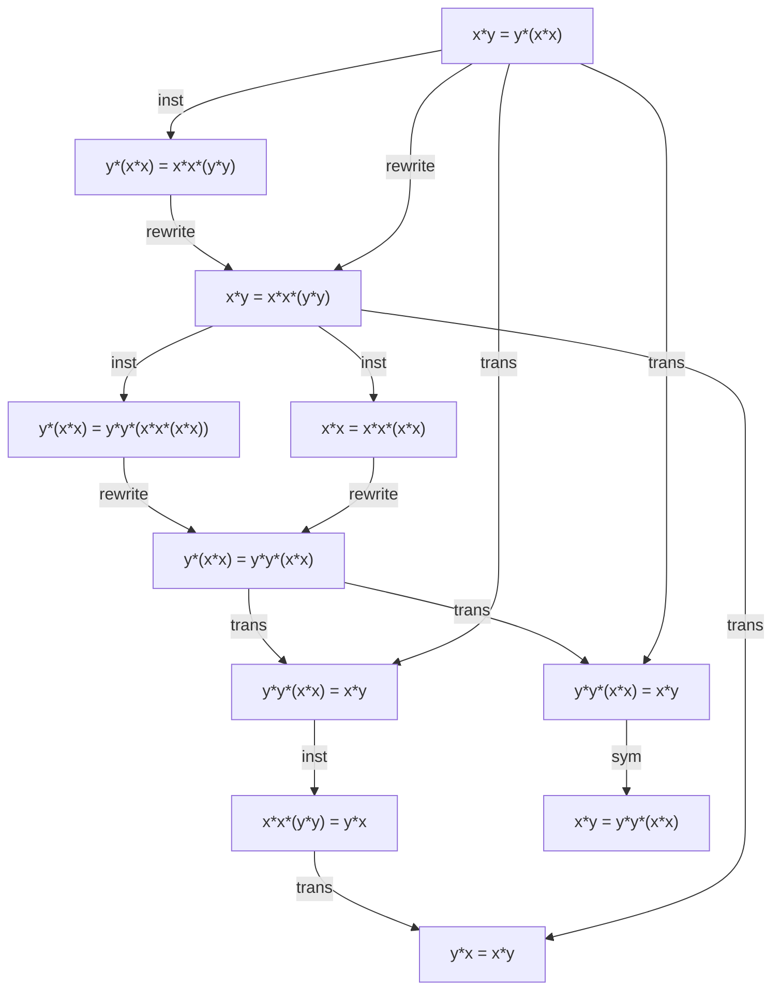

# magmaexplorer report: commute

_11 entries_

## Entries

| # | Kind | Statement | Sources | Steps |
|---|------|-----------|---------|-------|
| [0] | equation | `x*y = y*(x*x)` | - | - |
| [1] | equation | `y*(x*x) = x*x*(y*y)` | 0 | 1. inst [0] x:=y, y:=x*x |
| [2] | equation | `x*y = x*x*(y*y)` | 1, 0 | 1. rewrite [1] using [0] backwards |
| [3] | equation | `y*(x*x) = y*y*(x*x*(x*x))` | 2 | 1. inst [2] y:=x*x, x:=y |
| [4] | equation | `x*x = x*x*(x*x)` | 2 | 1. inst [2] y:=x |
| [5] | equation | `y*(x*x) = y*y*(x*x)` | 3, 4 | 1. rewrite [3] using [4] backwards |
| [6] | equation | `y*y*(x*x) = x*y` | 5, 0 | 1. trans [5] [0] |
| [7] | equation | `y*y*(x*x) = x*y` | 5, 0 | 1. trans [5] [0] |
| [8] | equation | `x*x*(y*y) = y*x` | 6 | 1. inst [6] x:=y, y:=x |
| [9] | equation | `x*y = y*y*(x*x)` | 7 | 1. sym [7] |
| [10] | equation | `y*x = x*y` | 8, 2 | 1. trans [8] [2] |

## Deduction graph

Each node shows the entry's magma statement. An arrow `na --> nb` means entry `b` cites entry `a` as a source.
Edge labels name the DSL primitive(s) that consumed the source while deriving the target.
Definitions are drawn as stadiums; equations as rectangles.

