# magmaexplorer report: commute.md

_11 entries_

## Entries

| # | Kind | Statement | Sources | Steps |
|---|------|-----------|---------|-------|
| [0] | equation | `x*y = y*(x*x)` | - | - |
| [1] | equation | `y*(x*x) = x*x*(y*y)` | 0 | 1. inst [0] x:=y, y:=x*x |
| [2] | equation | `x*y = x*x*(y*y)` | 1, 0 | 1. rewrite [1] using [0] backwards |
| [3] | equation | `y*(x*x) = y*y*(x*x*(x*x))` | 2 | 1. inst [2] y:=x*x, x:=y |
| [4] | equation | `x*x = x*x*(x*x)` | 2 | 1. inst [2] y:=x |
| [5] | equation | `y*(x*x) = y*y*(x*x)` | 3, 4 | 1. rewrite [3] using [4] backwards |
| [6] | equation | `y*y*(x*x) = x*y` | 5, 0 | 1. trans [5] [0] |
| [7] | equation | `x*x*(y*y) = y*x` | 6 | 1. inst [6] x:=y, y:=x |
| [8] | equation | `x*x*(y*y) = y*x` | 6 | 1. inst [6] x:=y, y:=x |
| [9] | equation | `y*x = x*x*(y*y)` | 7 | 1. sym [7] |
| [10] | equation | `y*x = x*y` | 8, 2 | 1. trans [8] [2] |

## Deduction graph

Each node is one entry. An arrow `[a] --> [b]` means `[b]` cites `[a]` as a source.
Definitions are drawn with rounded corners; equations with rectangles.

```mermaid
graph TD
    n0["x*y = y*(x*x)"]
    n1["&#91;1&#93; y*&#40;x*x&#41; = x*x*&#40;y*y&#41;"]
    n2["&#91;2&#93; x*y = x*x*&#40;y*y&#41;"]
    n3["&#91;3&#93; y*&#40;x*x&#41; = y*y*&#40;x*x*&#40;x*x&#41;&#41;"]
    n4["&#91;4&#93; x*x = x*x*&#40;x*x&#41;"]
    n5["&#91;5&#93; y*&#40;x*x&#41; = y*y*&#40;x*x&#41;"]
    n6["&#91;6&#93; y*y*&#40;x*x&#41; = x*y"]
    n7["&#91;7&#93; x*x*&#40;y*y&#41; = y*x"]
    n8["&#91;8&#93; x*x*&#40;y*y&#41; = y*x"]
    n9["&#91;9&#93; y*x = x*x*&#40;y*y&#41;"]
    n10["&#91;10&#93; y*x = x*y"]
    n0 --> n1
    n1 --> n2
    n0 --> n2
    n2 --> n3
    n2 --> n4
    n3 --> n5
    n4 --> n5
    n5 --> n6
    n0 --> n6
    n6 --> n7
    n6 --> n8
    n7 --> n9
    n8 --> n10
    n2 --> n10
```

